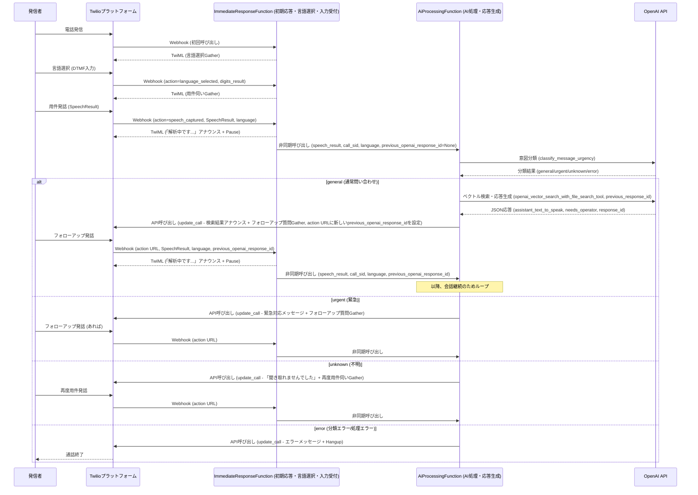

```mermaid
sequenceDiagram
    participant User as 発信者
    participant Twilio as Twilioプラットフォーム
    participant Lambda1 as ImmediateResponseFunction (初期応答・言語選択・入力受付)
    participant Lambda2 as AiProcessingFunction (AI処理・応答生成)
    participant OpenAI as OpenAI API

    User->>Twilio: 電話発信
    Twilio->>Lambda1: Webhook (初回呼び出し)
    Lambda1-->>Twilio: TwiML (言語選択Gather)
    User->>Twilio: 言語選択 (DTMF入力)
    Twilio->>Lambda1: Webhook (action=language_selected, digits_result)
    Lambda1-->>Twilio: TwiML (用件伺いGather)
    User->>Twilio: 用件発話 (SpeechResult)
    Twilio->>Lambda1: Webhook (action=speech_captured, SpeechResult, language)
    Lambda1-->>Twilio: TwiML (「解析中です...」アナウンス + Pause)
    Lambda1->>Lambda2: 非同期呼び出し (speech_result, call_sid, language, previous_openai_response_id=None)

    Lambda2->>OpenAI: 意図分類 (classify_message_urgency)
    OpenAI-->>Lambda2: 分類結果 (general/urgent/unknown/error)

    alt general (通常問い合わせ)
        Lambda2->>OpenAI: ベクトル検索・応答生成 (openai_vector_search_with_file_search_tool, previous_response_id)
        OpenAI-->>Lambda2: JSON応答 (assistant_text_to_speak, needs_operator, response_id)
        Lambda2->>Twilio: API呼び出し (update_call - 検索結果アナウンス + フォローアップ質問Gather, action URLに新しいprevious_openai_response_idを設定)
        User->>Twilio: フォローアップ発話
        Twilio->>Lambda1: Webhook (action URL, SpeechResult, language, previous_openai_response_id)
        Lambda1-->>Twilio: TwiML (「解析中です...」アナウンス + Pause)
        Lambda1->>Lambda2: 非同期呼び出し (speech_result, call_sid, language, previous_openai_response_id)
        Note over Lambda2: 以降、会話継続のためループ
    else urgent (緊急)
        Lambda2->>Twilio: API呼び出し (update_call - 緊急対応メッセージ + フォローアップ質問Gather)
        User->>Twilio: フォローアップ発話 (あれば)
        Twilio->>Lambda1: Webhook (action URL)
        Lambda1->>Lambda2: 非同期呼び出し
    else unknown (不明)
        Lambda2->>Twilio: API呼び出し (update_call - 「聞き取れませんでした」+ 再度用件伺いGather)
        User->>Twilio: 再度用件発話
        Twilio->>Lambda1: Webhook (action URL)
        Lambda1->>Lambda2: 非同期呼び出し
    else error (分類エラー/処理エラー)
        Lambda2->>Twilio: API呼び出し (update_call - エラーメッセージ + Hangup)
        Twilio-->>User: 通話終了
    end
```